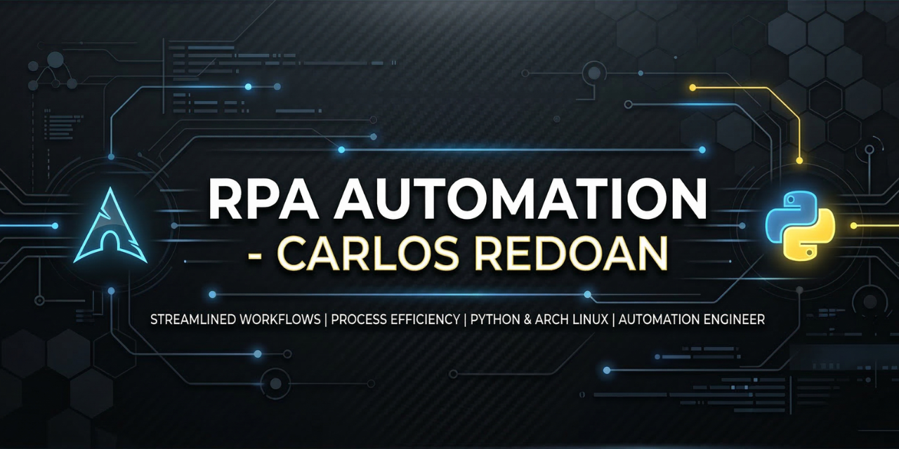

# 🤖 RPA de Cadastro Massivo (Python + PyAutoGUI)

Este projeto é uma automação de Processos Robóticos (RPA) desenvolvida para o preenchimento automatizado de formulários ERP via Web, utilizando dados de uma base CSV.

## 🛠️ Tecnologias e Ambiente
- **Linguagem:** Python 3.10+
- **Bibliotecas:** PyAutoGUI (Automação), Pandas (Dados), Pyperclip (Clipboard)
- **SO de Desenvolvimento:** Arch Linux 🚀
- **IDE:** Visual Studio Code

## 📍 Ferramenta de Calibração
Para garantir que o robô funcione em qualquer resolução de monitor, incluí o script `pegar_posicao.py` na pasta `/Gabarito`. Ele permite mapear as coordenadas exatas da sua tela antes da execução principal.

## 💼 Casos de Uso no Mercado
Este robô é modular e pode ser adaptado para diferentes demandas:
1. **Financeiro:** Lançamento massivo de notas fiscais e boletos.
2. **Logística:** Cadastro de fretes e rastreio em portais de transportadoras.
3. **E-commerce:** Atualização massiva de estoques e preços em Marketplaces.

## 🚀 Como Executar
1. Clone o repositório: `git clone https://github.com/CarlosRedoan/automacao-cadastro-python.git`
2. Instale as dependências: `pip install -r requirements.txt`
3. Execute a calibração se necessário (pasta Gabarito).
4. Rode o `codigo.py`.

---
Desenvolvido com foco em eficiência por **Carlos Redoan** 🚀